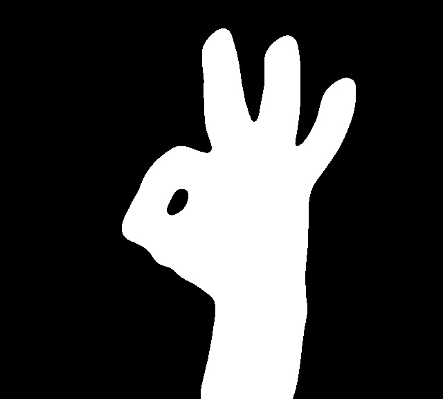
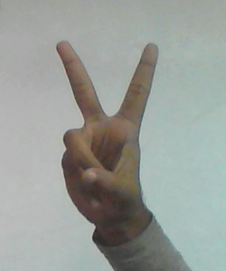
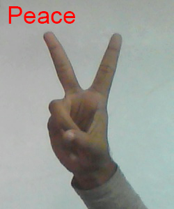

# Hand Gesture Recognition
In this project some basic hand gestures were trained to recognize in real time. The gestures are: palm, C, L, okay, nice. The training was done by the dataset from Kaggle. As the dataset was in silhouette, which makes it faster to recognize, real-time camera output should be like that too. For that real time captured images are converted to silhouettes, using HSV, dilation and erosion. The accuracy came out to be 97%. For future implementation the dataset can be used for actual gestures of deaf or dumb people. As this result is real-time, it can also be implemented in mobile devices.
## Dataset:
https://github.com/athena15/project_kojak/tree/master/frames
## Training dataset samples:

## Input images:
Raw input: 
 
After preprocessing: 

## Output:

